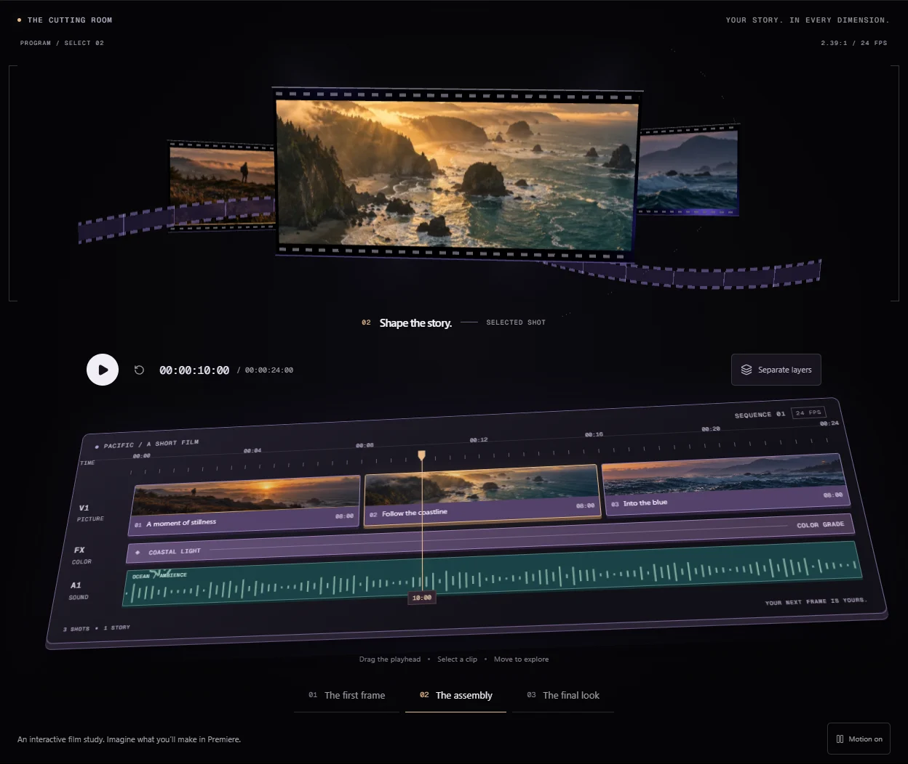
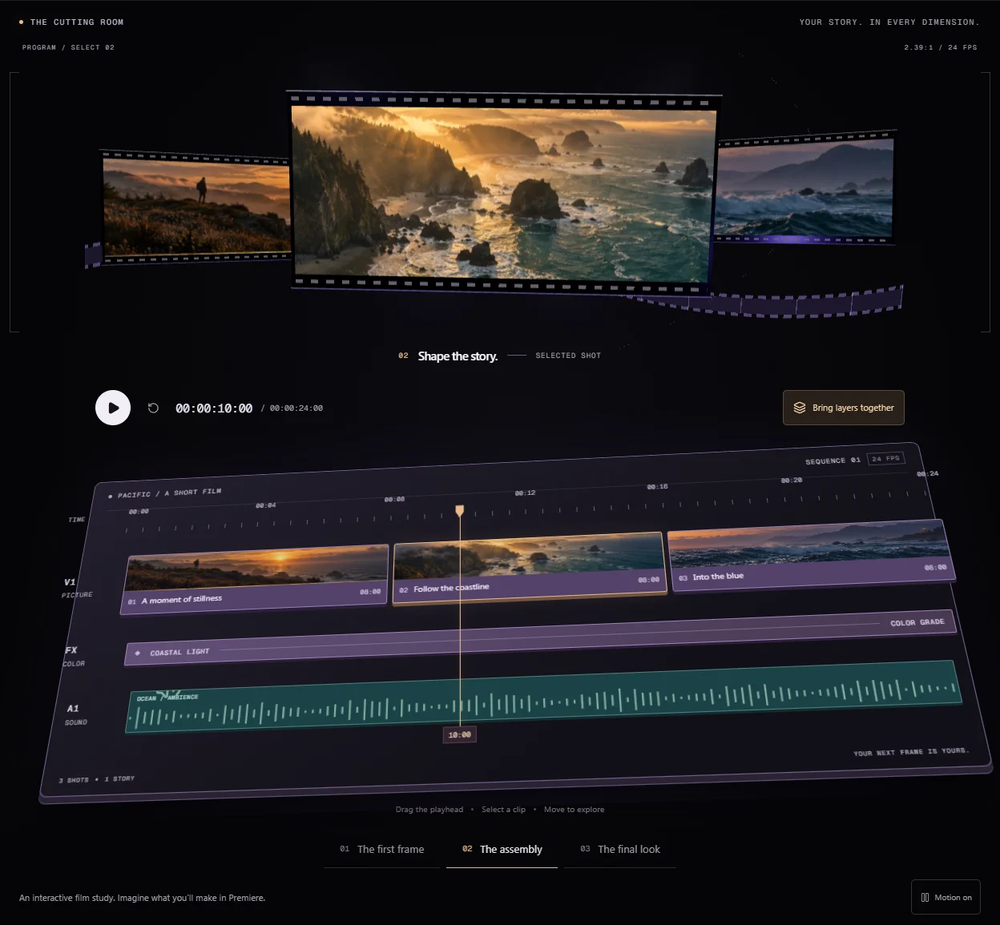
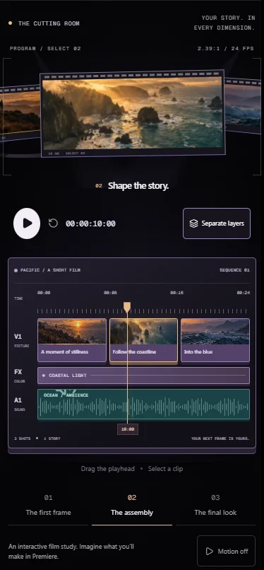

# The cutting room — interactive 3D parallax timeline

## Design

The cinematic homepage becomes a floating editing desk. Three photographic film
frames sit above a dimensional timeline, with a curved perforated filmstrip,
projector haze, and drifting particles. Pointer and scroll parallax move the
film preview above a fixed perspective timeline. The timeline retains its 3D angle
and controls without following the pointer or shifting on scroll. Premiere violet,
charcoal, warm amber,
and original coastal artwork connect the scene to the product's editing workflow.

The timeline uses real HTML controls:

- Drag the playhead or use arrow keys, Home, and End to scrub a 24-second sequence
  at 24 frames per second. Timecode, selected clip, caption, and featured film
  frame share the same state.
- Select a timeline clip, floating film frame, or chapter button to bring that
  shot forward. The three film frames move smoothly to their new positions.
- Play, pause, rewind, and replay advance through the three still-image shots.
- “Separate layers” lifts picture, color, and sound into separate depth planes.
  “Bring layers together” restores the compact desk.

This is an interactive film study using still images. The waveform is decorative;
there is no audio playback, live Premiere session, or media-editing backend.
Product links, installation flows, and experiment assignment are unchanged.

## MCP editing playground — September 15 refinement

The cutting room now explains the connection between an assistant, MCP and the
local bridge, and Adobe Premiere Pro. Three guided requests show the read, edit,
and readback stages while changing the sample sequence:

- Trim the opening to four seconds and close the gap.
- Move the blue shot to the beginning, keeping all three shots.
- Add a review marker at the current playhead position.

Visitors can also drag shots into a new order, adjust the selected clip's duration
between two and eight seconds, and undo or reset edits. The ruler, clip widths,
timecode, playback endpoint, selected shot, and film preview share the edited
sequence. Continuous duration drags create a single undo entry. Markers stay within
the sequence when it gets shorter; duplicate markers and edits do not create
extra undo entries. The demo keeps up to 12 markers and 30 undo entries.

Keyboard users can move clips with Alt + left/right, use the Earlier/Later buttons,
or adjust the native duration slider. Touch supports horizontal clip dragging and
the same explicit buttons. The lower desk keeps its fixed perspective; pointer
parallax moves only the film composition above it.

The browser simulates these requests locally. It does not send a prompt, upload
media, or connect to an installed Premiere session. The interface labels this as
an interactive demo with sample media. Optional tool details use the repository's
real `get_sequence_structure`, `trim_clip`, `move_clip`, `add_marker`,
`delete_marker`, and `get_sequence_markers_by_type` schemas with fictional clip
IDs. The examples illustrate the protocol flow, not a guarantee of support on a
particular installed Premiere version. The waveform and color track remain visual
context; the film frames are generated stills.

## Runtime

- WebGL loads separately on fine-pointer viewports at least 900px wide.
- Rendering stops offscreen, in hidden tabs, and when motion is paused.
- Parallax updates CSS variables and a shared WebGL ref without React rerenders.
  Pointer dragging holds the parallax target steady so the ruler stays underhand.
- Sequence playback begins only on request and suspends offscreen or in hidden
  tabs. The page motion toggle controls decorative motion; explicit transport
  controls remain usable with reduced motion.
- Reduced-motion and Save-Data preferences default to the HTML still composition.
- Mobile, no-JavaScript, loading, and WebGL failure states retain a layered HTML
  composition using the same artwork. The mobile image is under 50 KB. Mobile
  timeline controls use a flat layout with touch targets and no WebGL dependency.
- The native range input and buttons provide keyboard and touch interaction.
  Caption announcements occur on shot changes; timecode updates are not live
  screen-reader announcements. Without JavaScript, the scene remains static.
- A single texture atlas is reused across the three frames. Shader patterns draw
  film perforations; CSS and one SVG path draw the ruler and waveform.
- Pixel ratio is capped at 1.5; no postprocessing or additional runtime dependency.

## Asset provenance

Created with the built-in image-generation tool on 2026-09-15. These are original,
generated film stills, not existing film footage. The source is retained in the
Codex generated-images directory; optimized assets are versioned in the project:

- `landing/public/marketing/cinema-coast-atlas.webp`: 1536 × 1024, 194,216 bytes.
- `landing/public/marketing/cinema-coast-atlas-mobile.webp`: 800 × 533, 48,996 bytes.

Prompt: Create an original cinematic contact sheet with three equally sized
horizontal widescreen coastal film stills stacked vertically, edge to edge.
Top: a distant lone silhouette on a rugged Pacific coast ridge at amber sunset,
mist, dark grasses, and ocean. Middle: aerial craggy coastline and sea stacks,
golden light through fog, deep turquoise ocean. Bottom: blue-hour rolling waves,
spray, jagged coastal mountains, violet haze, and a distant lighthouse. Use
photographic realism, anamorphic cinematography, organic 35mm texture, amber
highlights, and deep petrol shadows. No text, borders, interfaces, logos, or
watermarks. Maintain three precise horizontal bands in a landscape 3:2 atlas.

## Verification

The MCP playground's runtime coverage verifies composed requests, example tool details, duplicate markers,
independent undo, mouse and touch clip dragging, keyboard ordering, duration
changes, one undo entry per slider drag, and reset. Responsive and accessibility
checks cover the new controls alongside the existing motion and experiment cases.
The landing build enforces the 240,000-byte initial gzipped JavaScript budget.

Run from `landing`: `npm run build`, the targeted ESLint check, and
`npx playwright test e2e/homepage.spec.ts` after the root `npm run build`.
The browser suite covers both homepage variants, seven responsive widths from
320 to 1440px, accessibility, keyboard scrubbing and chapters, transport playback,
mouse dragging on the projected 3D ruler, clip selection with separated layers,
touch controls, motion, context loss, navigation, installation actions,
no-JavaScript content, and the existing analytics contract.

Preview the built treatment at `/design-preview/` through the repository HTTP
server. The original cutting-room design was deployed before this refinement.

Local results: root build, landing production build, targeted ESLint, and all 38
homepage browser tests passed. After the final spacing and visibility adjustments,
all eight affected responsive, accessibility, motion, interaction, touch, and
no-JavaScript checks passed again, including the projected 3D pointer drag.
The cinematic page loads 214,446 bytes of initial
gzipped JavaScript against the existing 240,000-byte limit. Browser checks also
confirmed offscreen disposal and successful WebGL re-entry. Mobile at 390px has
no overflow and loads no canvas. These are Chromium checks; Safari and Firefox
have not been verified in this run.

### Desktop

### Separated layers

### Mobile

