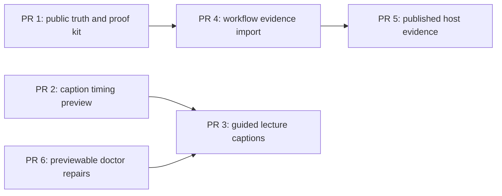

# Next improvement pull-request roadmap

- **Status:** Active planning roadmap
- **Updated:** 2026-09-04
- **Current baseline:** `premiere-pro-mcp@1.14.7`

## Purpose

The server now has 328 registered core tools, 326 tools under the default
authority profile, and 91 authenticated UXP additions. The next useful gains
are dependable outcomes, evidence-backed recovery, and clearer public truth—not
another undifferentiated increase in tool count.

This roadmap is deliberately not an implementation or compatibility claim.
Every host mutation and compatibility statement still needs the appropriate
licensed-host evidence.

## Delivery rules

1. Preserve the authority sequence: inspect, propose, preview, approve, apply,
   verify, then issue a receipt.
2. Keep local context and imported evidence opt-in, revision-bound, and free of
   credentials, native paths, and unrelated customer data.
3. Never silently replay a failed UXP mutation through CEP or QE.
4. Treat structural readback, playback review, rendered-output review, and
   publication as separate evidence levels.
5. Do not manufacture host evidence, product walkthroughs, or external review
   claims. A not-run result is useful and honest.
6. Keep public metadata generated from canonical release metadata and validate
   it in CI before it can drift across release surfaces.

## Recommended dependency order

PRs 1, 2, and 6 are independent. PR 3 should consume the timing-plan contract
from PR 2. PR 4 must keep the existing project-context revision rules. PR 5 is
blocked until a real, fixture-only licensed-host run is available.

## PR 1 — Public product truth and workflow-proof scaffolding

- Generate a machine-readable public product manifest from current release,
  package, and registry metadata.
- Define four outcome-oriented workflows and their separate verification
  boundaries.
- Publish a redacted workflow-proof runbook and receipt template.
- Link independent user reports as historical coverage, with no implication
  that their versions, counts, or host results are current.

**Acceptance:** `npm run product-manifest:check` fails on metadata drift. The
proof kit names no video or host receipt until one is actually recorded.

## PR 2 — Caption timing analysis and correction preview

- Parse a caller-provided SRT or VTT artifact without contacting Premiere or a
  provider.
- Compare caption timing to an explicit target duration and distinguish a
  constant offset from accumulating drift.
- Reject invalid timecodes, overlaps, and impossible scaling.
- Emit a bounded, deterministic correction preview with an opaque plan ID.

**Acceptance:** the analysis is read-only; it never modifies an artifact or a
Premiere sequence, and unit tests cover malformed files, overlap, offset,
drift, and boundary samples.

## PR 3 — Guided lecture-caption workflow

- Turn a verified caption plan into a checklist for duplicate/test-sequence
  import, caption-track readback, and beginning/middle/end review frames.
- Keep actual import and sequence mutation under existing tool authority and
  confirmation contracts.
- Return `structural_readback` separately from playback or rendered-output
  verification.

**Acceptance:** the guide is usable with an existing artifact and never claims
that importing captions establishes timing readability or rendered quality.

## PR 4 — Revision-bound editorial evidence import

- Add a schema for explicit transcript passages, speaker labels, shot logs,
  audio observations, operator notes, and frame references.
- Require source/timeline revision guards where a record attaches to a source
  or sequence.
- Normalize bounded metadata and refuse credentials, paths, and unsupported
  analysis shapes.
- Feed only saved local evidence into `create_editorial_context_pack`.

**Acceptance:** imports are local-only, revision-bound, and safe to use with
the existing context-pack/plan flow. They do not invoke vision, ASR, LLM, or
Adobe services.

## PR 5 — Fixture-only licensed-host workflow evidence

- Execute the proof runbook on supported operating systems with disposable
  fixtures.
- Retain redacted before/after/Undo evidence, structural results, and separate
  playback or render review when claimed.
- Publish a short walkthrough only after a reviewer verifies the fixture-only
  evidence bundle.

**Gate:** no release or documentation claim widens until actual host evidence
exists for the exact backend, Premiere version, and operation shown.

## PR 6 — Previewable `--doctor` repair plans

- Give each local readiness failure a stable diagnostic code.
- Add `--doctor --plan-fixes` to display a no-write repair plan.
- Add `--doctor --apply-fixes` only for safe, explicitly listed local repairs,
  with backups and post-repair verification.
- Keep host state, project state, tokens, paths, and raw configuration out of
  the doctor report and repair plan.

**Acceptance:** a repair plan cannot report Premiere connected, cannot open a
project, and cannot repair a host-side condition it did not observe.

## Success measures

- Time from install to the first safely verified workflow step.
- Local readiness failure rate, diagnostic-code distribution, and successful
  recovery rate without collecting private project data.
- Caption-plan validity and review completion rate, tracked only with approved
  bounded telemetry.
- Host evidence coverage by exact Premiere version, backend, operating system,
  and verification level.

Stars, raw downloads, and changing tool counts are discovery signals, not
evidence that an editor completed a safe workflow.
